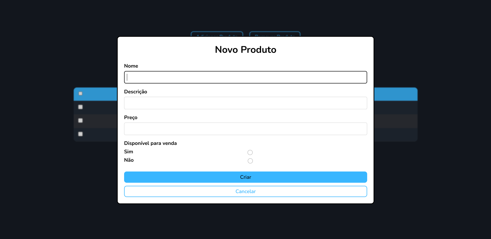

# Aplicação de Gerenciamento de Produtos
Este projeto foi desenvolvido como parte do teste prático da Oak Tecnologia. A aplicação tem como objetivo permitir o cadastro e a listagem de produtos.

## Tecnologias Utilizadas
- Frontend: Thymeleaf
- Backend: Java Spring Boot
- Banco de Dados: H2

## Funcionalidades
- Cadastro de Produtos: Permite que o usuário cadastre novos produtos no sistema.
- Listagem de Produtos: Exibe a lista de produtos cadastrados no sistema.

## Como Executar
### Pré-requisitos
Antes de rodar a aplicação, é necessário ter instalado:
- Java
- Maven

### Passos para Executar
1. Clonar o Repositório

```
git clone https://github.com/gustavoglins/product-system.git
```
2. Entrar na pasta do projeto
```
cd product-system
```

3. Executar o projeto:
```
mvn spring-boot:run
```

#### Isso iniciará o servidor backend, que estará disponível em http://localhost:8080.

## Prévia do Projeto



